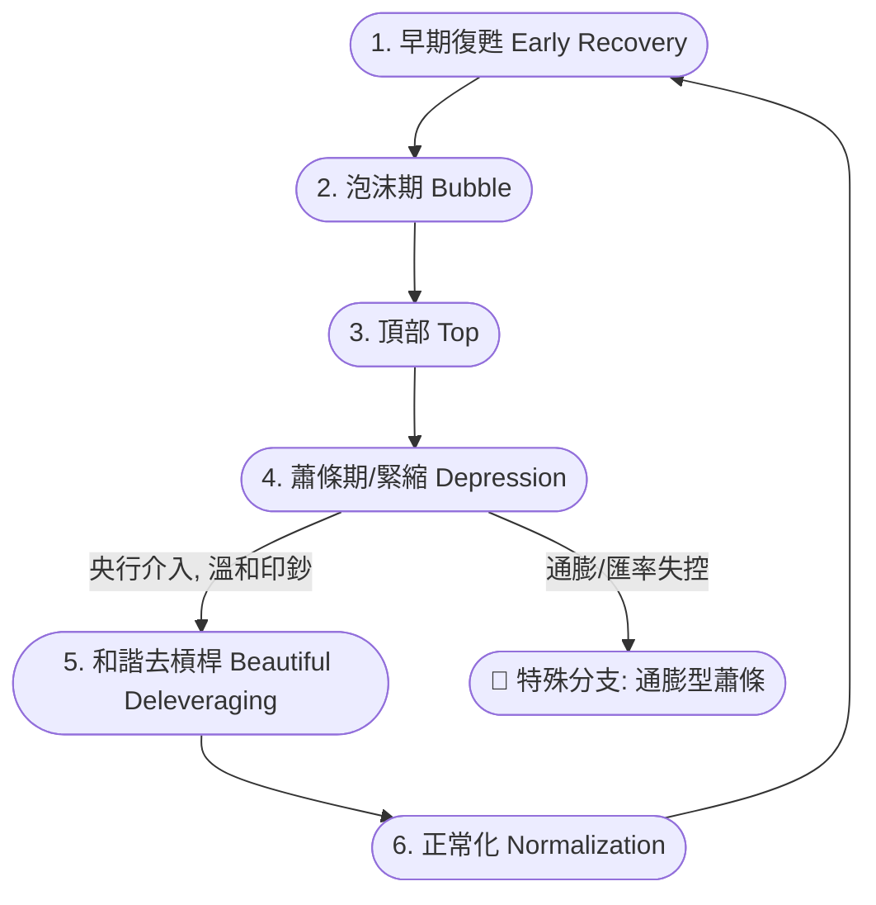

# 📖 Dalio 債務週期與投資邏輯指南

本文件將詳解在 **Dalio Cycle Sentinel 2.0 系統** 中，關於「債務週期」的各階段演變順序、系統判定邏輯，以及針對該週期的戰術資產配置 (Tactical Asset Allocation) 建議。

---

## 🔄 債務週期的迴圈與先後順序

在 Ray Dalio 的理論中，每一局的債務循環通常呈現一個**標準的六階段循環 (Archetypal Debt Cycle)**。經濟的衰退到繁榮，皆是由債務（信貸）的擴張與收縮所驅動。儘管中央銀行的極端政策可能縮短或拉長某階段，但整體演進依然有跡可循：

> [!NOTE]
> 在這個循環中，**信貸是經濟的引擎**。當信貸擴張快於產出時即形成「泡沫」，當信貸無以為繼時即觸發「頂部」與「蕭條」。

---

## ⛰️ 階段判定邏輯與投資策略

系統 (`debt-cycle-engine.js`) 會實時監控 9 大總經數據 (GDP, 10年期公債, 殖利率曲線, 信用利差, 債務佔比, 通膨率, M2 貨幣等)，計算各階段的特徵得分 (Score)，並給出最佳配置建議。

### 階段一：早期復甦 (Early Recovery)
* **處境**：經濟剛從谷底爬升，央行政策寬鬆，信貸開始重新流向生產力。
* **系統判定邏輯**：
  - 實質 GDP (Real GDP Growth) 強勁反彈 (> 2.0%)。
  - 沒有高通膨威脅。
  - 整體債務相對於 GDP 的佔比處於低位。
  - 長端殖利率 (10Y Bond) 小於名目 GDP 增速，且殖利率曲線呈陡峭的「正斜率」(Spread > 1.5%)。
* **💰 投資配置方向 (Risk-On)**：
  - **加碼**：股票 (Stocks) +15%、原物料 (Commodities) +5%。
  - **減碼**：現金 (Cash) -10%、長天期公債 (Bonds) -10%。
  - *這是賺取資本利得的最佳時期，因為資金便宜且企業盈餘正在修復。*

### 階段二：泡沫期 (Bubble)
* **處境**：樂觀情緒蔓延，借貸極度容易，資產價格的增長超越了實質經濟的增速，人們開始舉債投機。
* **系統判定邏輯**：
  - M2 貨幣成長率顯著高出實質經濟增長。
  - 系統內整體債務比率 (Debt/GDP) 急速攀升，越過警戒閾值。
  - (目前在模型中多與 Top 前夕特徵融合觀察)。
* **💰 投資配置方向 (Taking Profits)**：
  - **加碼**：黃金 (Gold) +5%（對沖無節制的信用擴張）。
  - **減碼**：股票微幅調降，開始將超額獲利轉向保護性資產。

### 階段三：頂部 (Top)
* **處境**：央行因為看見通膨或過熱，開始踩煞車 (升息)。資金成本上升，高度擴張的借貸者陷入還款壓力，資產價格開始搖搖欲墜。
* **系統判定邏輯**：
  - **殖利率曲線倒掛 (Yield Curve Inversion)**：10年期減2年期利差小於 0。
  - **利率高於經濟增長 (Rate Squeeze)**：10年期殖利率 > (名目 GDP 增長率 + 安全邊際)。
  - 高債務比加上信用利差 (Credit Spread) 開始微微擴大。
* **💰 投資配置方向 (Defensive)**：
  - **加碼**：現金 (Cash) +15%（子彈上膛，保留流動性）、公債 (Bonds) +5%。
  - **減碼**：股票 (Stocks) -20%（避開估值殺）。
  - *現金在此時是王道，等待資產價格崩落後的進場點。*

### 階段四：蕭條期 (Depression)
* **處境**：泡沫破裂，企業與個人違約大增，經濟陷入衰退，產生恐慌性拋售。
* **系統判定邏輯**：
  - 實質 GDP 陷入負增長或急墜。
  - 信用利差 (Credit Spread) 劇烈擴張，顯示市場流動性匱乏 (Credit Crunch)。
* **💰 投資配置方向 (Crisis Alpha)**：
  - **加碼**：長天期美國公債 (TLT) +20%（賺取避險資金湧入與預期降息的巨額資本利得）。
  - **減碼**：股票 (Stocks) -15%、原物料 (Commodities) -5%。

> [!WARNING]
> **🚨 系統重點監測：通膨型蕭條 (Inflationary Depression)**
> 如果在蕭條期間，通膨不但沒有降溫，反而 CPI 持續過熱，這就是最致命的「停滯性通膨」或「匯率劇貶」階段。此時系統會觸發 **AC3 緊急防禦**：
> - **暴力加碼黃金與 TIPS (抗通膨債)**，防禦法幣價值的崩潰。
> - 大幅砍出股票與長年期一般公債 (因為通膨將吃掉公債的實質收益)。

### 階段五：和諧去槓桿 (Beautiful Deleveraging)
* **處境**：Dalio 的招牌名詞。面對蕭條，央行找到了完美的平衡點：適度印鈔 (通膨化債務) + 推動債務重組，使得名目經濟成長率「剛好大於」名目借貸利率，痛苦被平緩化。
* **系統判定邏輯**：
  - 高債務比環境下，經濟重拾增長 (> 0)。
  - M2 貨幣供給大於 GDP 增長，而通膨維持在「溫和區間」 (例如 2% ~ 4%)。
  - 利率被有效地壓制在名目 GDP 增速之下。
* **💰 投資配置方向 (Reflation Trade)**：
  - **加碼**：黃金 (Gold) +10%（承接印鈔的溢價）、股票 (Stocks) +5%（受惠於資金行情）。
  - **減碼**：公債 (Bonds) -10%（因利率已被壓低且面臨溫和通膨威脅）。

### 階段六：正常化 (Normalization)
* **處境**：去槓桿完成，壞帳清理完畢，經濟重新穩步向前走，各項指標回歸中性歷史區間。
* **系統判定邏輯**：
  - 無任何極端的利率、通膨、或利差異象。
* **💰 投資配置方向 (All Weather Base)**：
  - 系統回歸到經典的 **All Weather Portfolio (全天候基準配置)**。
  - 通常是股票 30%、公債 40%、中期債 15%、黃金 7.5%、原物料 7.5% 等黃金比例，用最安穩的姿態等待下一次循環的早期復甦。

---

> [!IMPORTANT]
> **大國興衰的影響 (Big Cycle)**
> 這個六階段模型僅是「債務週期」。這套 2.0 系統同時會觀察 **18 項大國實力指標** 以及 **外部衝突指數**。這代表即便處於「早期復甦」，若該國正面臨高度外部衝突 (ECI > 7) 或儲備貨幣快速崩潰，系統仍會在最底層邏輯啟動資產的強制避險傾斜。這正是將《變動中的世界秩序》精神融合進來的原因！
